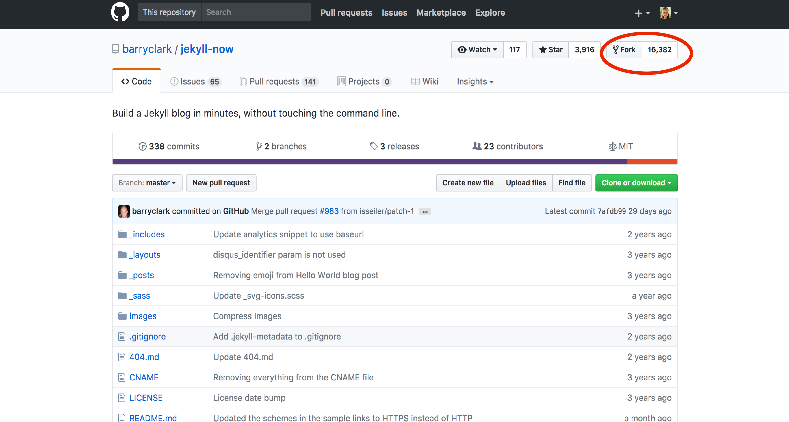
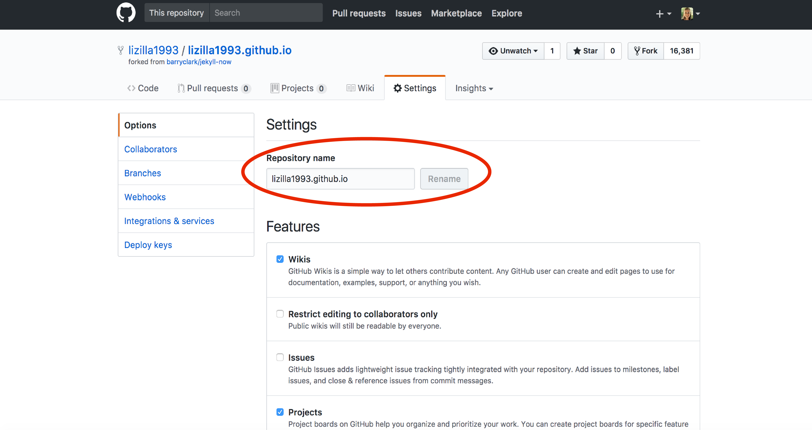
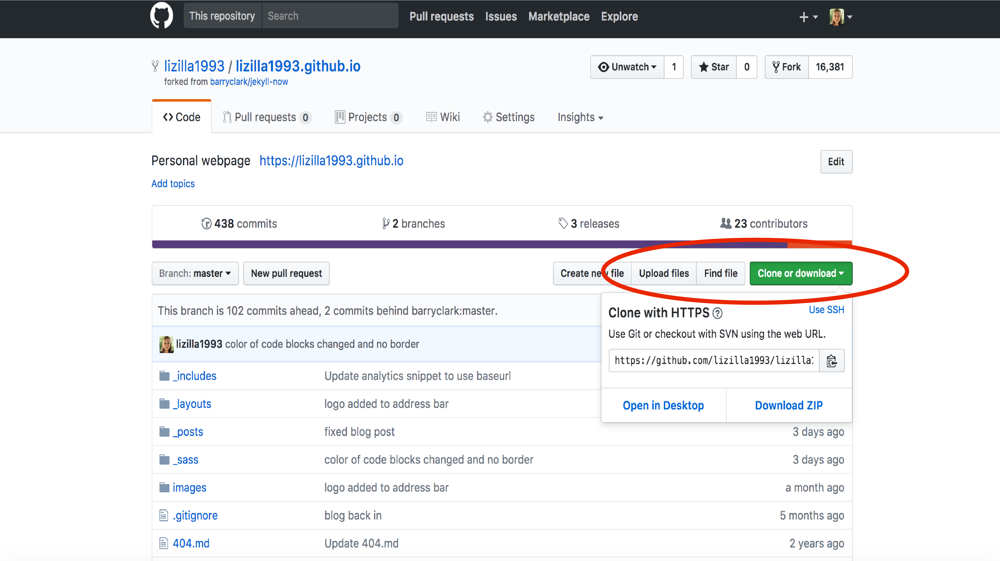

GitHub Pages is a static site hosting service that hosts your website directly from a GitHub repository in which you edit and push your changes from. You can create and publish GitHub pages online using Jekyll's themes, or work locally through the command line. GitHub pages can be used to host user, organization, or project website. You are allowed one page per user, and unlimited project pages per user/organization. There are several templates which you can fork/clone from directly on Github, and therefore don't have to know a lick of HTML/CSS. This lesson is to show you how you can easily get up and running with virtually any template to launch your personal website with Jekyll/GitHub Pages. 

[Jekyll](https://jekyllrb.com/) is used to generate your site from plain text to a static website, and [GitHub Pages](https://pages.github.com/) hosts the generated website. There are several [Jekyll Themes](http://jekyllthemes.org/) that you can choose from. For today, we will be working with the [Jekyll Now](http://www.jekyllnow.com/) theme designed by Barry Clark. It's a really quick and easy way to get up and running with a personal website and blog. 

The first element of creating your website from a template is forking the template repository to your own GitHub repository, and giving it a specific name so that GitHub pages knows where to build the repository to. Go to the [Jekyll Now GitHub repository](https://github.com/barryclark/jekyll-now). Get started by following these steps:

**1. Fork the template GitHub repository to your own repository.** 



**2.  Go to the settings page of your forked repository.**



**3. Change the name of the repository as follows:**

_yourusername.github.io_

The name of this repository _must_ follow this format in order to render correctly. 

**4. Voila! A functional static site at your specific address. Now to personalize it!**

Before we start personalizing the Jekyll Now template, there are two ways you can go about it. You can either work through the command line using Jekyll, or work directly in GitHub Pages. We will show you both approaches, starting with the command line approach to practice the git tools we learned in the first half of the workshop. To do so, `cd` into a directory where you want to work on your website in. This can be your Desktop or any directory of your choosing. To clone the directory, click on the green clone/download button in your website repository: 



Once you are in the directory of your choosing, type in the following command: 

```
git clone https://github.com/lizilla1993/lizilla1993.github.io.git
```

Where the third argument is the copied address from your website repository. Now we can edit the Jekyll Now template from the command line and view our changes using Jekyll to build the static site at a temporary server before committing our changes to make the final product. 
