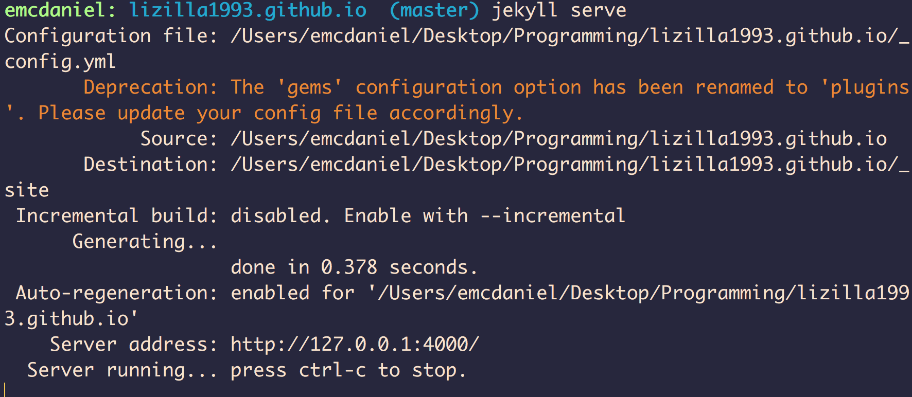
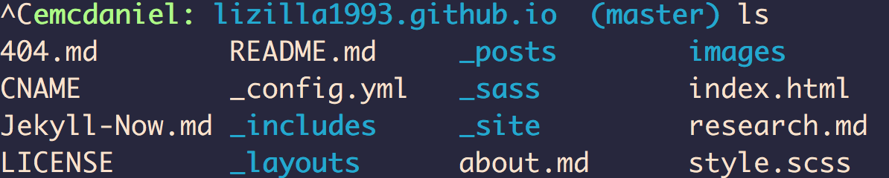

Generally speaking, most GitHub/Jekyll website templates that you fork from, there will be a README.md file explaining how to get up running fairly quickly. The [Jekyll Now README](https://github.com/barryclark/jekyll-now/blob/master/README.md) is a great resource for this particular template. 

Arguably, the most important file for personalizing your site is the `_config.yml` file. This is the master "configuration" file in your site's root directory that contains global configurations and variable definitions. `cd` into the website directory that you cloned down from GitHub, and open the `_config.yml` file in a Text Editor. I highly recommend TextWrangler or the newest version of it, [BBEdit](https://www.barebones.com/products/bbedit/). Once you have opened it in a text editor, you should see the following (without my insertions): 

For this particular template, this is where you change your name, description, and links to social media outlets that appears as icons at the footer of each page of the website. You can include your email address, Twitter handle, LinkedIn profile, etc. 

Now, it would be really inconvenient to have to add, commit, and push all of your changes to GitHub to then have to wait for the site to render online to view what you changes actually look like. Jekyll provides a nice solution for this. Make sure you are `cd`'ed into the directory where the `_config.yml` file is accessible. For example, don't `cd` into another directory just yet. When you `ls`, your view should look like:

Type in the command `jekyll serve` and the following should appear in your terminal:  

Copy and paste the server address into your browser. You should now see the changes you made or any problems. You can now edit the rest of the personal information. 

Since this is most likely a professional website, you will probably want to add separate pages or "tabs" describing yourself and your research. In this template, new "tabs" or separate pages are created by adding a new Markdown file in the main directory. In my directory, I have an `about.md` file and a `research.md` file:

You can create new markdown files in a text editor. If you are unfamiliar with Markdown, here is a good [cheatsheet](https://github.com/adam-p/markdown-here/wiki/Markdown-Cheatsheet). With markdown, you can add links, images, and simple formatting changes such as **bold**, _italices_ and headers. You can take a quick look at the Markdown cheatsheet to see how easy it is to create documents with Markdown. 

Once you are satisfied with the changes you have made and viewed with `jekyll serve`, you are ready to add, commit, and push to GitHub using the tools you learned in the first half of the workshop. Once you have pushed to your GitHub repository, it might take some time before your changes appear at **yourusername.github.io.** 

You can also use your GitHub pages website to make a blog. I currently write a (poorly maintained) blog where I sparsely talk about issues in science or describe a conference I went to. Most Jekyll templates allow for you to create a blog powered by Markdown. This is really great because you are getting started with a website and a blog without having to know HTML/CSS. 

We can also show you how to make changes to your website directly through GitHub. 

We can also take a look at the breadth of available [Jekyll Templates](http://jekyllthemes.org/), and how each one implements the same elements that we have shown throughout this workshop. 

