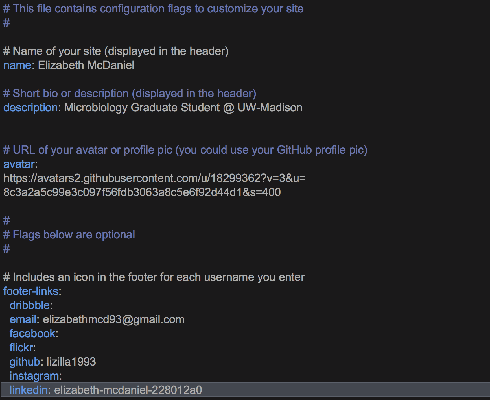

Generally speaking, most GitHub/Jekyll website templates that you fork from, there will be a README.md file explaining how to get up running fairly quickly. The [Jekyll Now README](https://github.com/barryclark/jekyll-now/blob/master/README.md) is a great resource for this particular template. 

Arguably, the most important file for personalizing your site is the `_config.yml` file. This is the master "configuration" file in your site's root directory that contains global configurations and variable definitions. `cd` into the website directory that you cloned down from GitHub, and open the `_config.yml` file in a Text Editor. I highly recommend TextWrangler or the newest version of it, [BBEdit](https://www.barebones.com/products/bbedit/). Once you have opened it in a text editor, you should see the following (without my insertions): 

For this particular template, this is where you change your name, description, and links to social media outlets that appears as icons at the footer of each page of the website. You can include your email address, Twitter handle, LinkedIn profile, etc. 

Now, it would be really inconvenient to have to add, commit, and push all of your changes to GitHub to then have to wait for the site to render online to view what you changes actually look like. Jekyll provides a nice solution for this. Make sure you are `cd`'ed into the directory where the `_config.yml` file is accessible. For example, don't `cd` into another directory just yet. When you `ls`, your view should look like:

Type in the command `jekyll build` and the following should appear in your terminal:  

